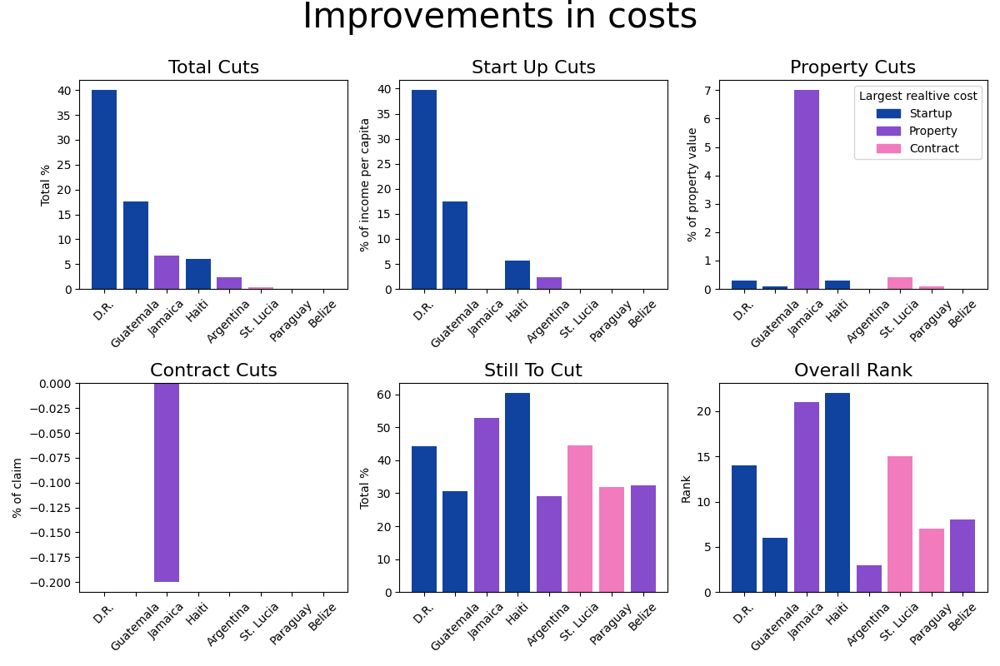

# Doing-Business-in-Latin-America

This notebook visualizes changes in the relative cost of doing business in Latin America from 2015-2019. The results show that although there were some countries with cost increases and others with no changes, the general trend has been towards lower costs in Latin America.

- The notebook used to access the World Bank API can be found [here.](world_bank_api.ipynb)
- The SQL script used to manipulate the data can be found [here.](cuts.sql)
- The data visualization notebook can be found [here.](visualize_data.ipynb)

 

 

This visualization includes the following statistics obtained from the World Bank API and manipulated with SQL:

- Total cost cuts (start-up % + property % + contract %)  
- Start-up cost cuts (% of income per capita)  
- Property registration cost cuts (% of property value)  
- Contract enforcement cost cuts (% of claim)  
- Total percentage costs still to cut  
- Overall rank (lower is better)  
